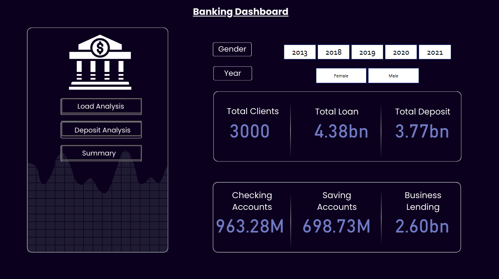

# 💳 Banking Analysis Dashboard

## 1️⃣ Problem Statement
Banks face significant challenges in balancing **profitability with financial risk**. Loan defaults, low savings engagement, and inefficient allocation of financial products can negatively affect profitability.  
The key problem: **How can banks leverage customer data to predict repayment likelihood, optimize financial products, and improve client relationship management?**

---

## 2️⃣ Solution
This dashboard uses **Power BI** to integrate and analyze customer and banking data.  

With interactive visuals, decision-makers can:  
- Identify **high-risk customers** and proactively mitigate potential defaults.  
- Analyze **income distribution, savings, and deposits** to segment clients effectively.  
- Evaluate **advisor performance** and its influence on customer portfolios.  
- Compare **business vs. personal banking behaviors** for better service differentiation.  

By combining **EDA (Exploratory Data Analysis)** with visualization, the bank gains a **data-driven decision-making tool** for credit approvals, client engagement, and risk assessment.

---

## 3️⃣ About Dataset
The dataset consists of multiple interconnected tables:

- **Client-Banking Table**  
  Contains demographic and financial information such as deposits, loans, accounts, credit cards, and superannuation.

- **Banking Relationship Table**  
  Tracks client classifications (Retail, Private Bank, Institutional, Commercial), risk weighting, and assigned advisors.

- **Gender Table**  
  Provides demographic segmentation for gender-based insights.

- **Investment Advisor Table**  
  Captures advisors linked to each client, enabling advisor-level performance evaluation.

Together, these tables enable **end-to-end EDA and visualization** for banking insights.

---

## 4️⃣ Key Insights
📊 **Deposits & Savings Correlation**  
- Strong correlation between **Bank Deposits** and **Saving Accounts** indicates consistent and disciplined customer engagement.

📊 **Income, Age & Wealth Accumulation**  
- Moderate correlation between **Age**, **Estimated Income**, and account balances (Superannuation, Checking, Savings).  
- Older customers and higher earners accumulate more wealth, with higher balances across accounts.

📊 **Property Ownership**  
- Weak correlation with deposits, loans, and savings.  
- Likely driven by **location, inheritance, or external factors**, not by active banking engagement.

📊 **Business vs. Personal Banking**  
- Moderate correlation between **Business Lending** and **Bank Loans**, showing overlap in financial obligations.  
- Low correlation with deposits and property, suggesting business loans serve a **distinct client segment**.

---

## 5️⃣ Dashboard Preview


---

## 6️⃣ Tech Stack
- **Power BI** for visualization  
- **Python (Pandas, Matplotlib, Seaborn)** for exploratory data analysis  
- **SQL** for dataset preparation and transformations  

---

## 7️⃣ How to Use
1. Clone this repository  
   ```bash
   git clone https://github.com/your-username/banking-dashboard.git
